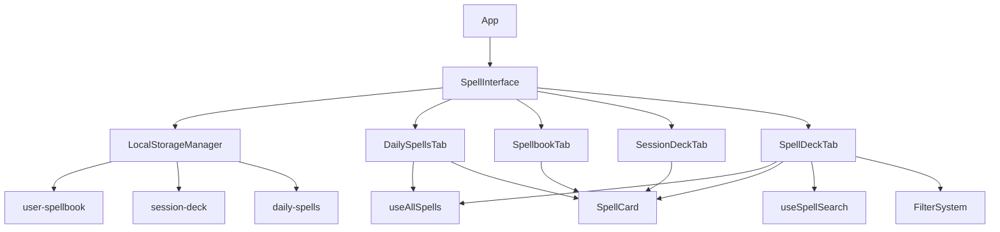

# Design Document

## Overview

This design restructures the existing class-based spell interface into a simplified, user-centric
tabbed system. The new architecture eliminates complex class-based data processing in favor of four
focused tabs that directly serve user needs. The design prioritizes code simplicity, component
reusability, and optimal user experience while maintaining the existing spell data infrastructure.

## Architecture

### High-Level Component Structure

```
App
├── SpellInterface (new main component)
│   ├── Tab: Spells of the Day
│   │   └── DailySpellsTab
│   │       └── SpellCard (reused)
│   ├── Tab: Spellbook
│   │   └── SpellbookTab
│   │       └── SpellCard (reused)
│   ├── Tab: Session Deck
│   │   └── SessionDeckTab
│   │       └── SpellCard (reused)
│   └── Tab: Spell Deck
│       └── SpellDeckTab
│           ├── SearchAndFilters
│           └── SpellCard (reused)
```

### Data Flow Architecture



## Components and Interfaces

### 1. SpellInterface (Main Container)

**Purpose**: Replace the current SpellDeck component as the main interface container.

**Props**: None (self-contained)

**State**:

- `activeTab`: Current active tab identifier
- Uses Chakra UI Tabs for tab management

**Key Methods**:

- Tab switching logic
- Initialization of localStorage data

### 2. DailySpellsTab

**Purpose**: Display 12 randomly selected spells that refresh daily at midnight.

**Props**: None (manages own data)

**State**:

- `dailySpells`: Array of 12 spell objects
- `lastGenerated`: Date timestamp for midnight refresh logic

**Key Methods**:

- `generateDailySpells()`: Creates new random selection
- `checkForMidnightRefresh()`: Validates if refresh is needed
- `loadDailySpells()`: Loads from localStorage or generates new

**Data Source**: Uses existing `useAllSpells` hook (to be created) that fetches complete spell
database

### 3. SpellbookTab

**Purpose**: Personal spell library management with level-based organization.

**Props**: None (manages own data)

**State**:

- `spellbookSpells`: Array of user's saved spells
- `groupedSpells`: Spells organized by level (Cantrips, Level 1-9)

**Key Methods**:

- `addToSpellbook(spell)`: Adds spell if not duplicate
- `removeFromSpellbook(spellId)`: Removes spell from collection
- `addToSession(spell)`: Adds spell to session deck
- `groupSpellsByLevel()`: Organizes spells for display

**Actions Available on SpellCard**:

- "Remove from Spellbook" button
- "Add to Session" button

### 4. SessionDeckTab

**Purpose**: Active session spell management with burn/remove functionality.

**Props**: None (manages own data)

**State**:

- `sessionSpells`: Array of session spells with unique IDs
- `groupedSpells`: Spells organized by level

**Key Methods**:

- `addToSession(spell)`: Adds spell with unique session ID
- `burnSpell(sessionId)`: Removes leveled spell instance
- `clearSession()`: Removes all spells from session
- `groupSpellsByLevel()`: Organizes spells for display

**Special Logic**:

- Cantrips (level 0) cannot be burned - different visual styling
- Leveled spells (1-9) can be burned and are removed
- Each spell instance gets unique `sessionId` for tracking

**Actions Available on SpellCard**:

- "Burn Spell" button (for leveled spells)
- Visual indicator for cantrips (unlimited use)
- "Clear Session" button (global action)

### 5. SpellDeckTab

**Purpose**: Complete searchable and filterable spell index.

**Props**: None (manages own data)

**State**:

- `searchTerm`: Current search input
- `filters`: Object containing class, level, school filters
- `filteredSpells`: Computed filtered and searched results

**Key Methods**:

- `handleSearch(term)`: Updates search term with debouncing
- `handleFilterChange(filterType, value)`: Updates filter criteria
- `applyFiltersAndSearch()`: Combines filtering and searching logic

**Sub-components**:

- `SearchInput`: Text search with debouncing
- `FilterDropdowns`: Class, Level, School filter selectors
- `ResultsCounter`: Shows number of matching spells

**Data Source**: Uses existing spell fetching infrastructure but loads all spells instead of
class-specific

### 6. Enhanced SpellCard Component

**Purpose**: Reusable spell display component across all tabs.

**Props**:

- `spell`: Spell object with all spell data
- `context`: String indicating which tab is using the card ("daily", "spellbook", "session", "deck")
- `onAction`: Callback function for context-specific actions
- `sessionId`: Optional unique ID for session spells
- `isCantrip`: Boolean for special cantrip styling

**Dynamic Actions Based on Context**:

- **Daily**: "Add to Spellbook", "Add to Session"
- **Spellbook**: "Remove from Spellbook", "Add to Session"
- **Session**: "Burn Spell" (if not cantrip), visual cantrip indicator
- **Deck**: "Add to Spellbook", "Add to Session"

## Data Models

### LocalStorage Data Structure

```javascript
// localStorage key: "user-spellbook"
{
  spells: [
    {
      index: "acid-arrow",
      name: "Acid Arrow",
      level: 2,
      // ... full spell object
    }
  ],
  lastModified: "2024-01-15T10:30:00Z"
}

// localStorage key: "session-deck"
{
  spells: [
    {
      sessionId: "1642234567890_123", // timestamp + random
      index: "acid-arrow",
      name: "Acid Arrow",
      level: 2,
      // ... full spell object
    }
  ],
  lastModified: "2024-01-15T10:30:00Z"
}

// localStorage key: "daily-spells"
{
  spells: [
    // Array of 12 spell objects
  ],
  generatedDate: "2024-01-15", // YYYY-MM-DD format
  lastModified: "2024-01-15T00:00:00Z"
}
```

### Spell Level Grouping Logic

```javascript
const groupSpellsByLevel = (spells) => {
	const grouped = spells.reduce((acc, spell) => {
		const levelKey = spell.level === 0 ? 'Cantrips' : `Level ${spell.level}`
		if (!acc[levelKey]) acc[levelKey] = []
		acc[levelKey].push(spell)
		return acc
	}, {})

	// Sort spells within each level alphabetically
	Object.keys(grouped).forEach((level) => {
		grouped[level].sort((a, b) => a.name.localeCompare(b.name))
	})

	return grouped
}

const getLevelOrder = () => [
	'Cantrips',
	'Level 1',
	'Level 2',
	'Level 3',
	'Level 4',
	'Level 5',
	'Level 6',
	'Level 7',
	'Level 8',
	'Level 9'
]
```

## Error Handling

### LocalStorage Error Recovery

```javascript
const safeLoadFromStorage = (key, defaultValue) => {
	try {
		const stored = localStorage.getItem(key)
		return stored ? JSON.parse(stored) : defaultValue
	} catch (error) {
		console.warn(`Failed to load ${key} from localStorage:`, error)
		return defaultValue
	}
}

const safeSaveToStorage = (key, data) => {
	try {
		localStorage.setItem(key, JSON.stringify(data))
		return true
	} catch (error) {
		console.error(`Failed to save ${key} to localStorage:`, error)
		return false
	}
}
```

### API Error Handling

- Reuse existing error handling from current spell hooks
- Display user-friendly error messages with retry options
- Graceful degradation when spell data is unavailable
- Loading states for all data fetching operations

### Data Validation

```javascript
const validateSpellObject = (spell) => {
	return (
		spell &&
		typeof spell.index === 'string' &&
		typeof spell.name === 'string' &&
		typeof spell.level === 'number' &&
		spell.level >= 0 &&
		spell.level <= 9
	)
}

const validateSpellArray = (spells) => {
	return Array.isArray(spells) && spells.every(validateSpellObject)
}
```

## Testing Strategy

### Unit Testing Focus Areas

1. **LocalStorage Management**
    - Data persistence and retrieval
    - Error handling for corrupted data
    - Data validation and sanitization

2. **Daily Spell Generation**
    - Random selection algorithm
    - Midnight refresh logic
    - Duplicate prevention

3. **Spell Grouping Logic**
    - Level-based organization
    - Alphabetical sorting within levels
    - Edge cases (empty arrays, invalid levels)

4. **Search and Filter Logic**
    - Text search accuracy
    - Multi-filter combinations
    - Performance with large datasets

### Integration Testing

1. **Tab Navigation**
    - State preservation between tabs
    - Data consistency across components
    - Performance during tab switching

2. **Cross-Tab Actions**
    - Adding spells from Deck to Spellbook
    - Moving spells from Spellbook to Session
    - Data synchronization between tabs

### Component Testing

1. **SpellCard Reusability**
    - Correct action buttons per context
    - Proper styling for cantrips vs leveled spells
    - Event handling for different contexts

2. **Filter System**
    - Dropdown functionality
    - Filter combination logic
    - Search within filtered results

## Performance Considerations

### Data Loading Strategy

- **Lazy Loading**: Only load complete spell database when Spell Deck tab is accessed
- **Caching**: Leverage existing React Query caching for spell data
- **Debouncing**: 300ms debounce on search input to prevent excessive filtering
- **Virtualization**: Consider virtual scrolling if spell lists become very long

### Memory Management

- **Component Unmounting**: Proper cleanup of timers and event listeners
- **Data Structures**: Use Maps for O(1) lookups where appropriate
- **Memoization**: Use React.memo and useMemo for expensive computations

### LocalStorage Optimization

- **Selective Updates**: Only save changed data, not entire datasets
- **Compression**: Consider compressing large spell objects if storage becomes an issue
- **Cleanup**: Periodic cleanup of old or invalid data

## Migration Strategy

### Phase 1: New Component Creation

- Create new SpellInterface component alongside existing SpellDeck
- Implement all four tab components
- Set up new localStorage structure

### Phase 2: Data Migration

- Create migration utility to convert existing session data
- Preserve user's current session spells in new format
- Add backward compatibility for existing localStorage keys

### Phase 3: Component Replacement

- Replace SpellDeck with SpellInterface in App.js
- Remove old class-based components and hooks
- Clean up unused API functions and utilities

### Phase 4: Cleanup

- Remove deprecated components and files
- Update any remaining references
- Performance testing and optimization
